# Загрузим данные и необходимые пакеты (№1)


```r
insurance <- read.csv("insurance_cost.csv")
summary(insurance)
```

```
##       age            sex                 bmi           children    
##  Min.   :18.00   Length:1338        Min.   :15.96   Min.   :0.000  
##  1st Qu.:27.00   Class :character   1st Qu.:26.30   1st Qu.:0.000  
##  Median :39.00   Mode  :character   Median :30.40   Median :1.000  
##  Mean   :39.21                      Mean   :30.66   Mean   :1.095  
##  3rd Qu.:51.00                      3rd Qu.:34.69   3rd Qu.:2.000  
##  Max.   :64.00                      Max.   :53.13   Max.   :5.000  
##     smoker             region             charges     
##  Length:1338        Length:1338        Min.   : 1122  
##  Class :character   Class :character   1st Qu.: 4740  
##  Mode  :character   Mode  :character   Median : 9382  
##                                        Mean   :13270  
##                                        3rd Qu.:16640  
##                                        Max.   :63770
```

```r
library(dplyr)
library(ggplot2)
library(plotly)
library(ggbiplot)
library(ggpubr)
library(corrplot)
library(corrr)
library(fastDummies)
library(factoextra)
library(pheatmap)
library(FactoMineR)
library(devtools)
```

#График ИМТ-траты в plotly (№2)


```r
plot_ly(
  data = insurance,
  x = ~ bmi,
  y = ~ charges,
  color = ~ smoker)
```

# А теперь в ggplotly (№3)


```r
plot <- insurance %>%
  ggplot(aes(x = bmi, y = charges, color = smoker)) +
  geom_point(size = 1.5) +
  theme_light()

ggplotly(plot)
```

# Корреляционный анализ (№4)


```r
insurance_for_cor <- insurance %>%
  select(is.integer | is.numeric)

insurance_cor <- cor(insurance_for_cor)
insurance_cor
```

```
##                age   children       bmi    charges
## age      1.0000000 0.04246900 0.1092719 0.29900819
## children 0.0424690 1.00000000 0.0127589 0.06799823
## bmi      0.1092719 0.01275890 1.0000000 0.19834097
## charges  0.2990082 0.06799823 0.1983410 1.00000000
```

## Визуализируем матрицу


```r
corrplot(insurance_cor, method = "color", order = "alphabet", type = "upper")
```

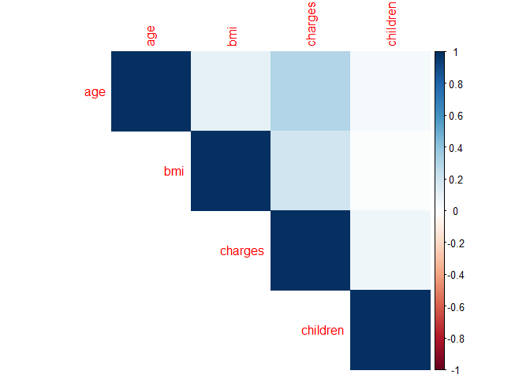<!-- -->

## И другим способом


```r
corrplot.mixed(insurance_cor, lower = "color", upper = "pie", order = "AOE")
```

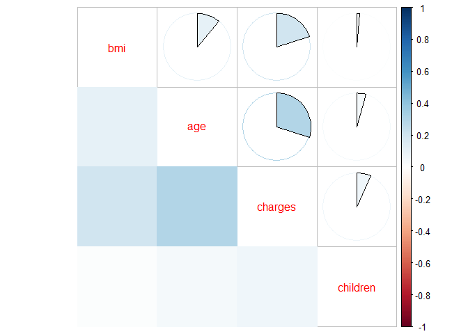<!-- -->

## И ещё одним


```r
insurance_cor %>%
  rplot()
```

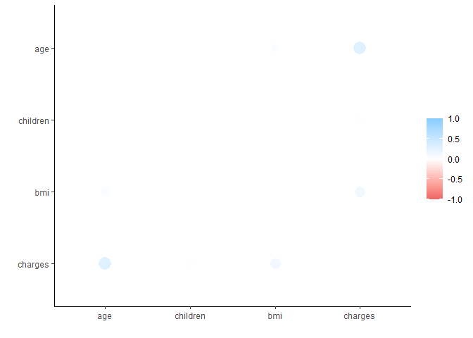<!-- -->

# Поработаем с датафреймом (№5)


```r
# Отберем все номинативные переменные и превратим их в бинарные и удалим оригинальные колонки из датафрейма

new_insurance <- dummy_cols(insurance, select_columns = c("sex", "smoker", "region"), remove_selected_columns = TRUE)
```

# Иерархическая классификация (№6)


```r
# Стандартизуем значения переменных

insurance_scaled <- scale(new_insurance)
head(insurance_scaled)
```

```
##             age        bmi    children    charges sex_female   sex_male
## [1,] -1.4382265 -0.4531506 -0.90827406  0.2984722  1.0101410 -1.0101410
## [2,] -1.5094011  0.5094306 -0.07873775 -0.9533327 -0.9892209  0.9892209
## [3,] -0.7976553  0.3831636  1.58033487 -0.7284023 -0.9892209  0.9892209
## [4,] -0.4417824 -1.3050431 -0.90827406  0.7195739 -0.9892209  0.9892209
## [5,] -0.5129570 -0.2924471 -0.90827406 -0.7765118 -0.9892209  0.9892209
## [6,] -0.5841316 -0.8073542 -0.90827406 -0.7856145  1.0101410 -1.0101410
##       smoker_no smoker_yes region_northeast region_northwest region_southeast
## [1,] -1.9698501  1.9698501       -0.5650556       -0.5662062       -0.6110952
## [2,]  0.5072734 -0.5072734       -0.5650556       -0.5662062        1.6351833
## [3,]  0.5072734 -0.5072734       -0.5650556       -0.5662062        1.6351833
## [4,]  0.5072734 -0.5072734       -0.5650556        1.7648211       -0.6110952
## [5,]  0.5072734 -0.5072734       -0.5650556        1.7648211       -0.6110952
## [6,]  0.5072734 -0.5072734       -0.5650556       -0.5662062        1.6351833
##      region_southwest
## [1,]        1.7648211
## [2,]       -0.5662062
## [3,]       -0.5662062
## [4,]       -0.5662062
## [5,]       -0.5662062
## [6,]       -0.5662062
```

```r
# И найдем дистанции

insurance_dist <- dist(insurance_scaled, method = "euclidean")
as.matrix(insurance_dist)[1:6, 1:6]
```

```
##          1        2        3        4        5        6
## 1 0.000000 5.825239 6.253322 5.747217 5.759522 4.978144
## 2 5.825239 0.000000 1.823634 4.289327 3.582563 3.361726
## 3 6.253322 1.823634 0.000000 4.663256 4.148789 3.956548
## 4 5.747217 4.289327 4.663256 0.000000 1.807952 4.583438
## 5 5.759522 3.582563 4.148789 1.807952 0.000000 4.329507
## 6 4.978144 3.361726 3.956548 4.583438 4.329507 0.000000
```

```r
# Высчитываем дендрограмму

insurance_hc <- hclust(d = insurance_dist, 
                        method = "ward.D2")

# И визуализируем

fviz_dend(insurance_hc, cex = 0.1)
```

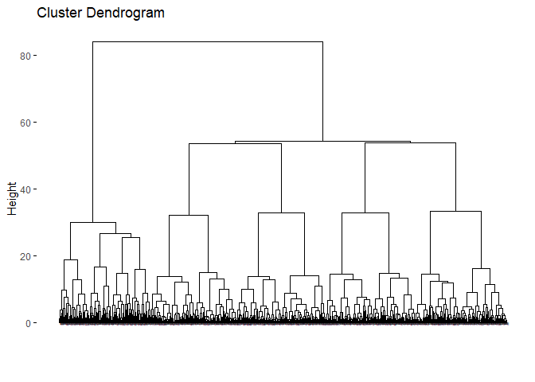<!-- -->

# Пробуем строить кластеризацию иначе (№7)


```r
fviz_dend(insurance_hc, k = 3, 
          cex = 0.1,
          k_colors = c("#FF99FF", "#33FF99", "#00CCFF"),
          color_labels_by_k = TRUE,
          type = "circular"
)
```

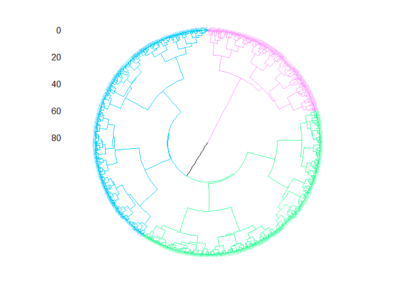<!-- -->

```r
clusters <- cutree(insurance_hc, k = 3)

fviz_cluster(list(data = insurance_scaled, cluster = clusters),
             palette = c("#FF99FF", "#33FF99", "#00CCFF"),
             ellipse.type = "convex", 
             repel = TRUE, 
             show.clust.cent = FALSE, 
             ggtheme = theme_light())
```

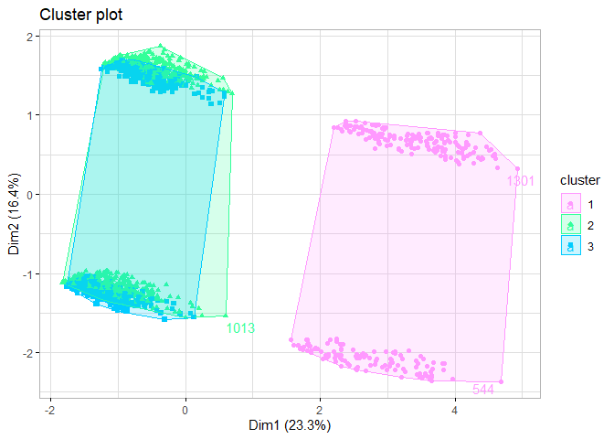<!-- -->

# Heatmap + иерархическая кластеризация (№8)


```r
pheatmap(insurance_scaled)
```

<!-- -->

# Проведем анализ данных new_insurance методом PCA


```r
insurance_pca <- prcomp(new_insurance, scale = T)

summary(insurance_pca)
```

```
## Importance of components:
##                           PC1    PC2    PC3    PC4    PC5     PC6     PC7
## Standard deviation     1.6737 1.4023 1.2417 1.1513 1.1498 1.07055 0.98583
## Proportion of Variance 0.2334 0.1639 0.1285 0.1105 0.1102 0.09551 0.08099
## Cumulative Proportion  0.2334 0.3973 0.5258 0.6363 0.7465 0.84196 0.92295
##                            PC8     PC9      PC10      PC11      PC12
## Standard deviation     0.87032 0.40877 2.012e-15 1.043e-15 7.413e-16
## Proportion of Variance 0.06312 0.01392 0.000e+00 0.000e+00 0.000e+00
## Cumulative Proportion  0.98608 1.00000 1.000e+00 1.000e+00 1.000e+00
```

Из полученных результатов видно, что 50% вариации данных объяснятся первыми тремя переменными. Посмотрим на это на графике:


```r
fviz_eig(insurance_pca, 
         addlabels = T, 
         ylim = c(0, 30)) +
  ggtitle("Как разные компоненты объясняют вариативность данных") +
  labs(x = "Измерения", y= "Процент объясненной вариативности") +
  theme_light() +
  theme(text = element_text(size = 10), plot.title = element_text(hjust = 0.5, size = 10))
```

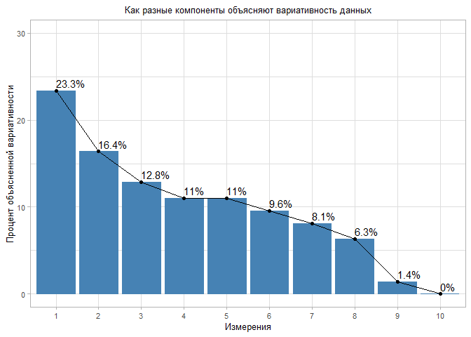<!-- -->

Посмотрим распределение переменных относительно pc1 и pc2:


```r
fviz_pca_var(insurance_pca, col.var = "contrib")
```

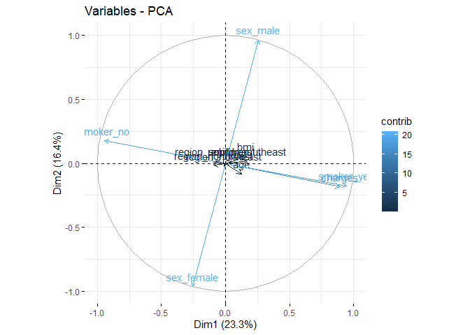<!-- -->

Из графика видно, что переменные *sex_male* и *sex_female* направлены строго противоположно, что логично, так как это несовместные события. То же справедливо и для переменных *smoker_yes* и *smoker_no*. Помимо этого, образовалась группа из переменных *charges* и *smoker_yes*. Переменные регионов проживания образовали тесную группу, сосредоточенную у центра окружности. Иными словами, регион проживания вносит незначительный вклад в анализируемые главные компоненты.

Чтобы немного почистить график, оставим только топ 5 самых важных переменных:


```r
fviz_pca_var(insurance_pca, 
             select.var = list(contrib = 5), 
             col.var = "contrib")
```

<!-- -->

Чтобы понять, что стоит за pc1, pc2 и pc3, построим графики:


```r
fviz_contrib(insurance_pca, choice = "var", axes = 1, top = 12)
```

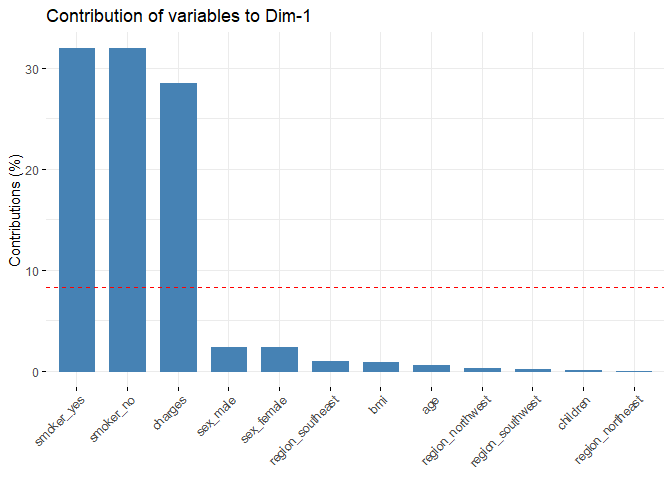<!-- -->

```r
fviz_contrib(insurance_pca, choice = "var", axes = 2, top = 12)
```

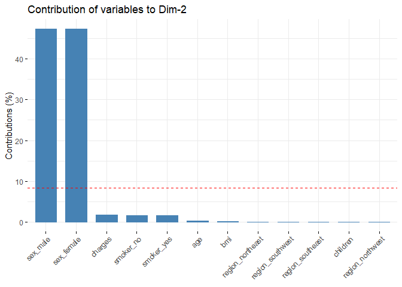<!-- -->

```r
fviz_contrib(insurance_pca, choice = "var", axes = 3, top = 12)
```

<!-- -->

Таким образом, переменная *smoker* хорошо кластериует наблюдения в оригинальном датасете. Аналогично можно судить о переменной *sex*.

И построим график ggbiplot, чтобы на нем одновременно изобразить переменные и наблюдения:


```r
ggbiplot(insurance_pca, 
         scale = 0, alpha = 0.1) + 
  theme_light()
```

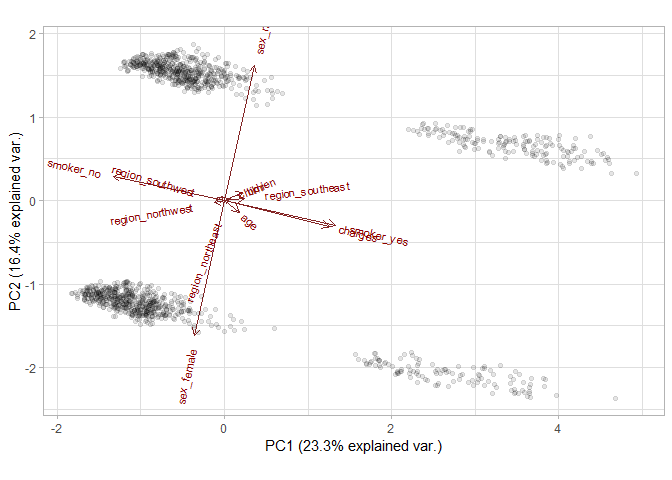<!-- -->

*Мне захотелось визуализировать кластеризацию по полу и статусу курильщика*


```r
ggbiplot(insurance_pca, 
         scale=0, 
         groups = as.factor(insurance$sex), 
         ellipse = T,
         alpha = 0.2) +
  theme_light()
```

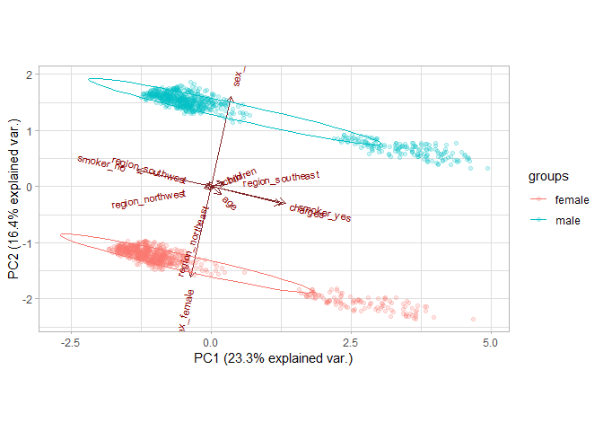<!-- -->

```r
ggbiplot(insurance_pca, 
         scale=0, 
         groups = as.factor(insurance$smoker), 
         ellipse = T,
         alpha = 0.2) +
  theme_light()
```

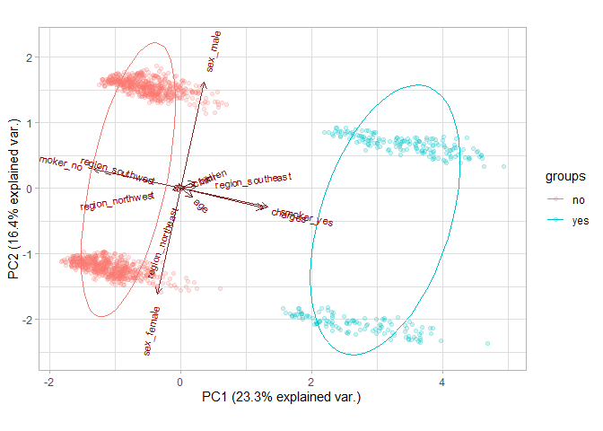<!-- -->


# Проведем кластеризацию по возрасту (№10)


```r
# Создадим сначала переменную age_group
new_insurance_age <- new_insurance %>%
  mutate(age_group = case_when(
    age < 26 ~ "18-25",
    age >= 26 & age < 41 ~ "26-40",
    age >= 41 & age < 56 ~ "41-55",
    age >= 56 ~ "56-65"
  ))

ggbiplot(insurance_pca, 
         scale=0, 
         groups = as.factor(new_insurance_age$age_group), 
         ellipse = T,
         alpha = 0.2) +
  theme_light()
```

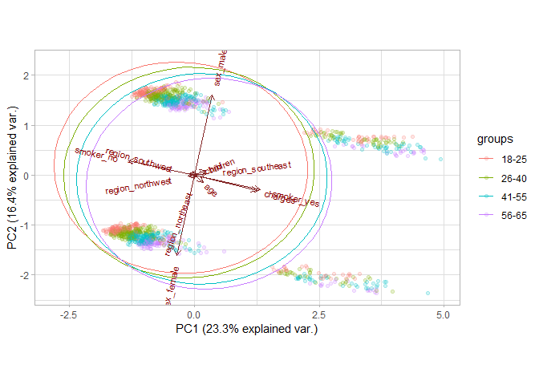<!-- -->

# Добавим еще номинативные переменные


```r
# Создадим переменную any_child, которая будет рассказывать о том, есть ли у человека хотя бы один ребенок
new_insurance_children <- new_insurance %>%
  mutate(any_child = as.character(ifelse(children >= 1, "Yes", "No")))

ggbiplot(insurance_pca, 
         scale=0, 
         groups = as.factor(new_insurance_children$any_child), 
         ellipse = T,
         alpha = 0.2) +
  theme_light()
```

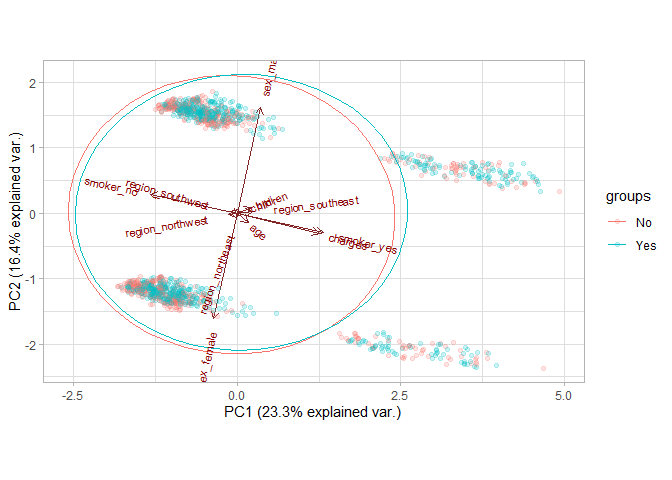<!-- -->


```r
# Создадим переменную, которая разобьет субъектов на группы в соответствии с тем, является ли их масса тела недостаточной, избыточной или нормальной

new_insurance_bmi <- new_insurance %>%
  mutate(bmi_group = case_when(
    bmi < 18.5 ~ "underweight",
    bmi >= 18.5 & bmi < 25 ~ "normal",
    bmi >= 25 ~ "overweight"
  ))

ggbiplot(insurance_pca, 
         scale=0, 
         groups = as.factor(new_insurance_bmi$bmi_group), 
         ellipse = T,
         alpha = 0.2) +
  theme_light()
```

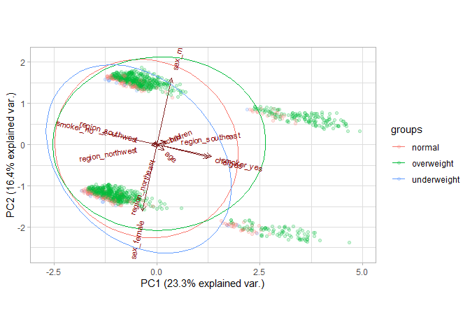<!-- -->

# Попробуем "поиграть" с данными, чтобы поднять качество анализа (№12)

## Эксперимент №1

Первая моя мысль - убрать из оригинального датафрейма очевидно кластеризующие переменные *sex* и *smoker* и посмотреть, что из этого получится.


```r
new_insurance_12_dummy <- dummy_cols(insurance, select_columns = c("region"), remove_selected_columns = TRUE)

new_insurance_12 <- new_insurance_12_dummy %>% select(where(is.numeric))

insurance_12_pca <- prcomp(new_insurance_12, scale = T) # Посчитаем PCA

summary(insurance_12_pca)
```

```
## Importance of components:
##                          PC1    PC2    PC3    PC4    PC5     PC6     PC7
## Standard deviation     1.281 1.1548 1.1503 1.1363 0.9874 0.87175 0.82285
## Proportion of Variance 0.205 0.1667 0.1654 0.1614 0.1219 0.09499 0.08464
## Cumulative Proportion  0.205 0.3717 0.5371 0.6985 0.8204 0.91536 1.00000
##                              PC8
## Standard deviation     5.458e-16
## Proportion of Variance 0.000e+00
## Cumulative Proportion  1.000e+00
```

```r
fviz_eig(insurance_12_pca, 
         addlabels = T, 
         ylim = c(0, 30)) +
  ggtitle("Как разные компоненты объясняют вариативность данных") +
  labs(x = "Измерения", y= "Процент объясненной вариативности") +
  theme_light() +
  theme(text = element_text(size = 10), plot.title = element_text(hjust = 0.5, size = 10))
```

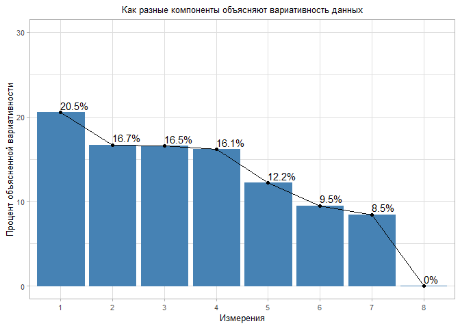<!-- -->

```r
fviz_pca_var(insurance_12_pca, col.var = "contrib") +
  ggtitle("Переменные - PCA") +
  theme_light() +
  theme(text = element_text(size = 10), plot.title = element_text(hjust = 0.5, size = 10))# Посмотрим, как выглядит график с нынешними переменными
```

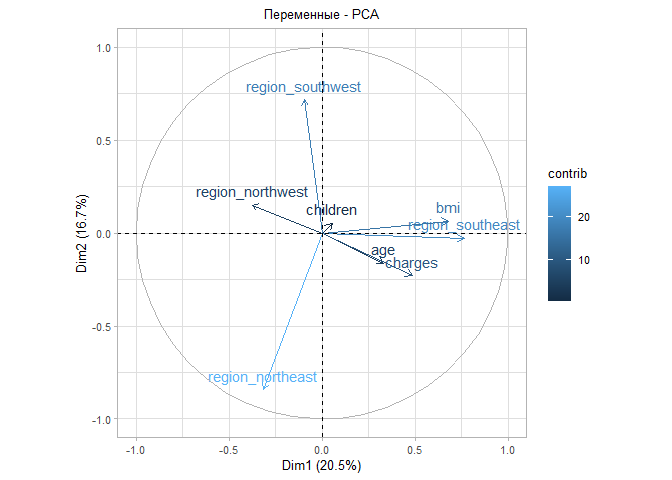<!-- -->

```r
# Отношение переменных к главным компонентам:
fviz_contrib(insurance_12_pca, choice = "var", axes = 1, top = 12)
```

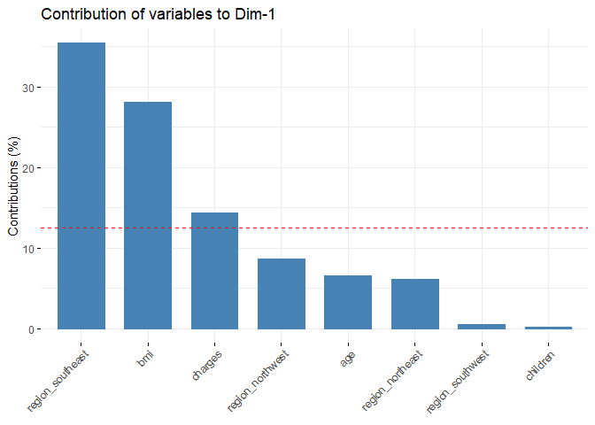<!-- -->

```r
fviz_contrib(insurance_12_pca, choice = "var", axes = 2, top = 12)
```

<!-- -->

```r
fviz_contrib(insurance_12_pca, choice = "var", axes = 3, top = 12)
```

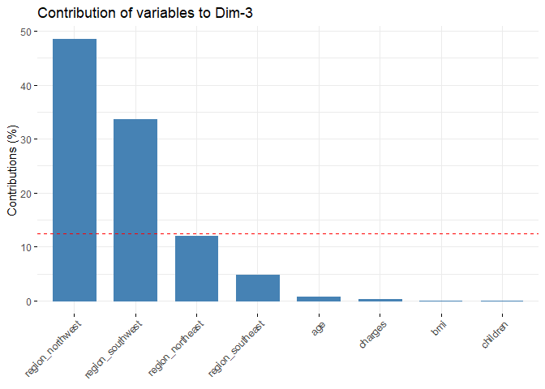<!-- -->

```r
ggbiplot(insurance_12_pca, 
         scale=0, 
         groups = as.factor(insurance$region), 
         ellipse = T,
         alpha = 0.2) +
  theme_minimal() # Визуализируем полученную кластеризацию
```

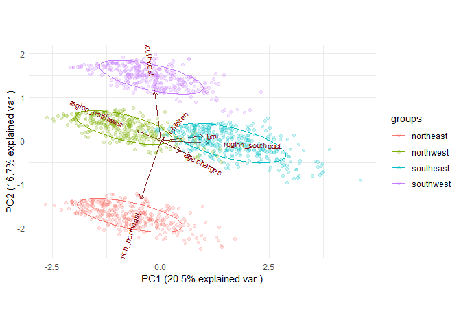<!-- -->

Из полученных данных можно судить о том, что сила кластеризации по полу и статуса курильщика была настолько высокой, что мы не могли увидеть, что наблюдения можно разделить и по регионам.

## Эксперимент №2

Раз уж начали играть с ИМТ, давайте переведем нашу номинативную переменную *bmi_group* в дамми.
(А пол и статус курильщика возвращать не будем)


```r
insurance_bmi <- insurance %>%
  mutate(bmi_group = case_when(
    bmi < 18.5 ~ "underweight",
    bmi >= 18.5 & bmi < 25 ~ "normal",
    bmi >= 25 ~ "overweight"
  ))

new_insurance_12_dummy_1 <- dummy_cols(insurance_bmi, select_columns = c("bmi_group", "region"), remove_selected_columns = TRUE)

new_insurance_12_1 <- new_insurance_12_dummy_1 %>% select(where(is.numeric)) 

new_insurance_12_1$bmi <- NULL

insurance_12_1_pca <- prcomp(new_insurance_12_1, scale = T) # Посчитаем PCA

summary(insurance_12_1_pca)
```

```
## Importance of components:
##                           PC1    PC2    PC3    PC4    PC5    PC6     PC7    PC8
## Standard deviation     1.4497 1.1667 1.1507 1.1433 1.1181 1.0006 0.98276 0.8301
## Proportion of Variance 0.2102 0.1361 0.1324 0.1307 0.1250 0.1001 0.09658 0.0689
## Cumulative Proportion  0.2102 0.3463 0.4787 0.6094 0.7344 0.8345 0.93110 1.0000
##                              PC9      PC10
## Standard deviation     8.607e-16 3.689e-16
## Proportion of Variance 0.000e+00 0.000e+00
## Cumulative Proportion  1.000e+00 1.000e+00
```

```r
fviz_eig(insurance_12_1_pca, 
         addlabels = T, 
         ylim = c(0, 30)) +
  ggtitle("Как разные компоненты объясняют вариативность данных") +
  labs(x = "Измерения", y= "Процент объясненной вариативности") +
  theme_light() +
  theme(text = element_text(size = 10), plot.title = element_text(hjust = 0.5, size = 10))
```

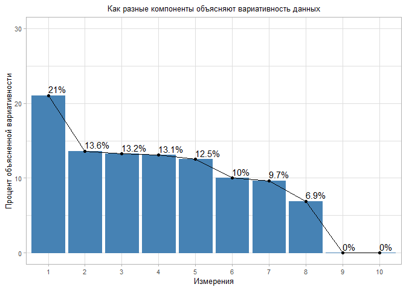<!-- -->

```r
fviz_pca_var(insurance_12_1_pca, col.var = "contrib") +
  ggtitle("Переменные - PCA") +
  theme_light() +
  theme(text = element_text(size = 10), plot.title = element_text(hjust = 0.5, size = 10))# Посмотрим, как выглядит график с нынешними переменными
```

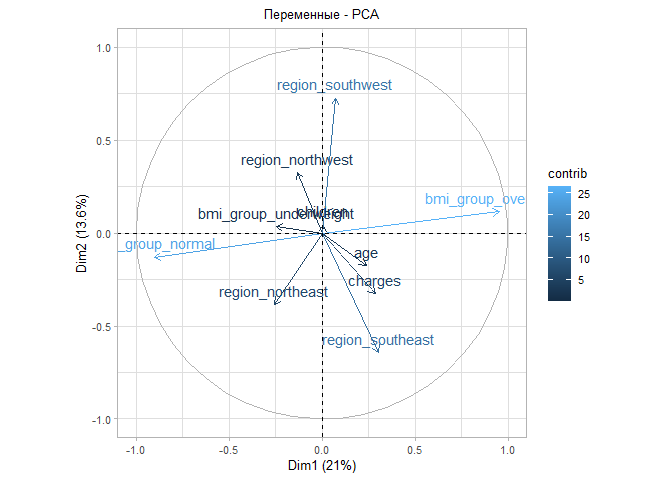<!-- -->

```r
# Отношение переменных к главным компонентам:
fviz_contrib(insurance_12_1_pca, choice = "var", axes = 1, top = 12)
```

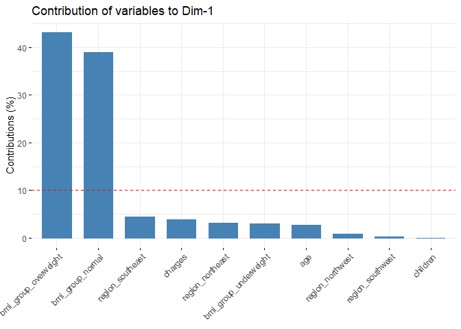<!-- -->

```r
fviz_contrib(insurance_12_1_pca, choice = "var", axes = 2, top = 12)
```

<!-- -->

```r
fviz_contrib(insurance_12_1_pca, choice = "var", axes = 3, top = 12)
```

<!-- -->

```r
ggbiplot(insurance_12_1_pca, 
         scale=0, 
         groups = as.factor(new_insurance_bmi$bmi_group), 
         ellipse = T,
         alpha = 0.2) +
  theme_minimal()
```

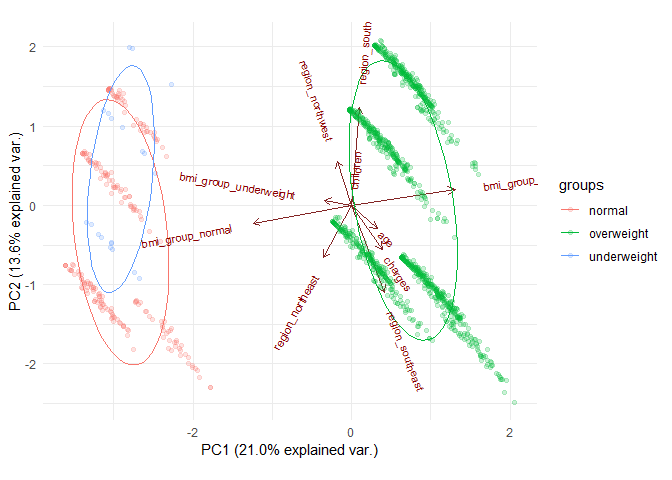<!-- -->

Не так выразительно, как в прошлом примере, но видно, что ИМТ тоже может стать переменной, по которой можно провести кластеризацию.
Мне кажется, что это довольно явно показывает, что манипулируя данными, можно сильно влиять на результат PCA. 

А если к этому графику добавить группировку по возрастной группе, получится красивый серпантин:


```r
ggbiplot(insurance_12_1_pca, 
         scale=0, 
         groups = as.factor(new_insurance_age$age_group), 
         ellipse = T,
         alpha = 0.2) +
  theme_minimal()
```

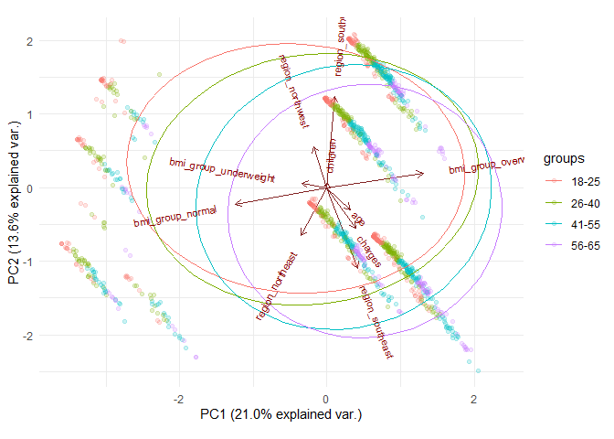<!-- -->

Дамми-переменная позволяет, во-первых, включить в анализ категориальную переменную. А во-вторых (как в случае с ИМТ) - позволяет искусственно создавать подвыборки для количественных переменных и смотреть, насколько это разделение может повлиять на кластеризацию.

*Прим. авт. - В случае с игрой в группы по ИМТ мне видится в этом какая-то искусственная кластеризация. Как будто, мы разделили людей, а потом увидели, что модель учла наше разделение при построении графика. Как будто тут что-то не то.*
